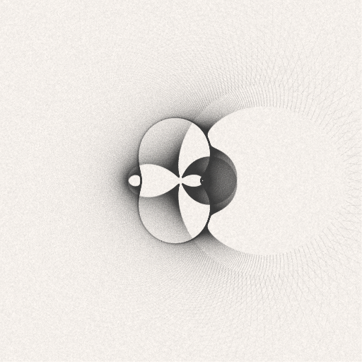
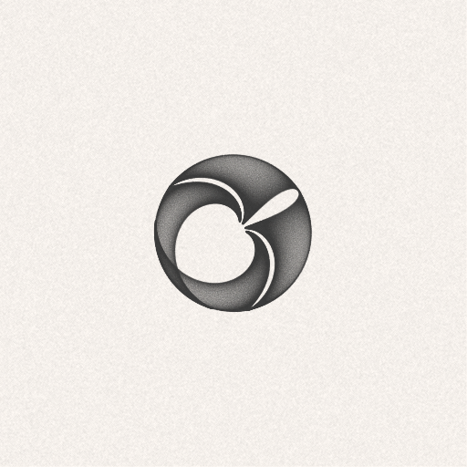

# About
* Processing is a flexible software sketchbook and a language for learning how to code within the context of the visual arts. Since 2001, Processing has promoted software literacy within the visual arts and visual literacy within technology. There are tens of thousands of students, artists, designers, researchers, and hobbyists who use Processing for learning and prototyping.
# Examples

| Example screenshots                          |                                              |                                              |
|----------------------------------------------|----------------------------------------------|----------------------------------------------|
|  |  |  |
